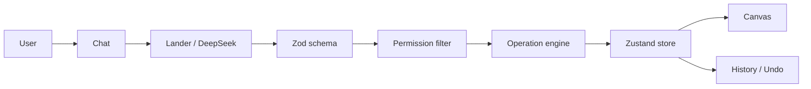
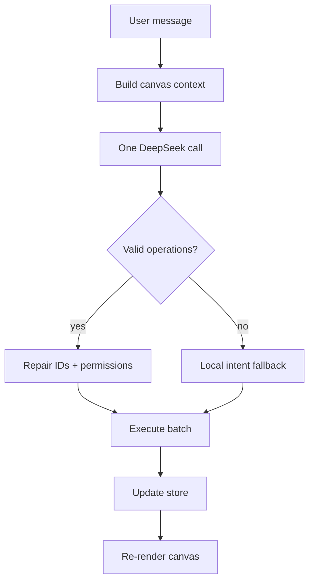

# Lander Bot

An AI design editor that edits **components**, not source files.

You speak in natural language. Lander interprets the intent. A deterministic engine applies a small, validated operation to a specific component instance.

---

## How it works

```
Natural language
      ↓
Lander Bot          intent interpreter
      ↓
Structured operation     move · scale · recolor · duplicate · …
      ↓
Zod schema               reject invalid JSON
      ↓
Permission filter        locked attributes cannot change
      ↓
Deterministic executor   state only, never eval / codegen
      ↓
Component state          Zustand
      ↓
Canvas                   Strands + Motion
```

Lander is not the renderer. The component engine is the renderer.

---

## Architecture



| Layer | Role |
| --- | --- |
| Chat | Conversation, selection, last-created / last-modified IDs |
| Lander | Turns language into structured operations |
| Schema | Every operation is validated before it can run |
| Permissions | Original / locked attributes cannot be bypassed |
| Engine | Pure state updates. One request → one transaction |
| Store | Source of truth. Persists locally |
| Canvas | Renders registered instances. Does not invent behavior |

---

## Agentic pattern

This is a **surgical component pattern**.

The agent does not rewrite the app. It does not generate React. It does not execute model output.

It targets a component ID and proposes one or more operations:

```
strand_1     original, can be protected
strand_2     independent copy
strand_3     independent copy
```

```
"Rotate the second one 180°"
        ↓
{ type: "rotate", targetIds: ["strand_2"], rotation: 180 }
        ↓
only strand_2 changes
```

| Pattern | What it means here |
| --- | --- |
| Intent → tool call | Language becomes a typed operation, not code |
| Surgical edit | Change one instance, leave the rest alone |
| Schema gate | Invalid model JSON never reaches the canvas |
| Policy layer | Permissions sit in front of the executor |
| Deterministic act | The engine mutates state. The model does not |
| Grounded references | `it`, `the copy`, `the third one` resolve from store, not guesswork |
| Atomic batch | Five copies is one undo, not five |

---

## Request path



One user request → one model call → one batch → one history entry.

---

## Stack

React · TypeScript · Vite · Tailwind · Motion · Zustand · Zod · DeepSeek · ogl / React Bits Strands

---

## Run locally

```bash
npm install
npm run dev
```

Add your key in `.env.local`:

```
DEEPSEEK_API_KEY=
DEEPSEEK_BASE_URL=https://api.deepseek.com
```

Open [http://localhost:5173](http://localhost:5173).
